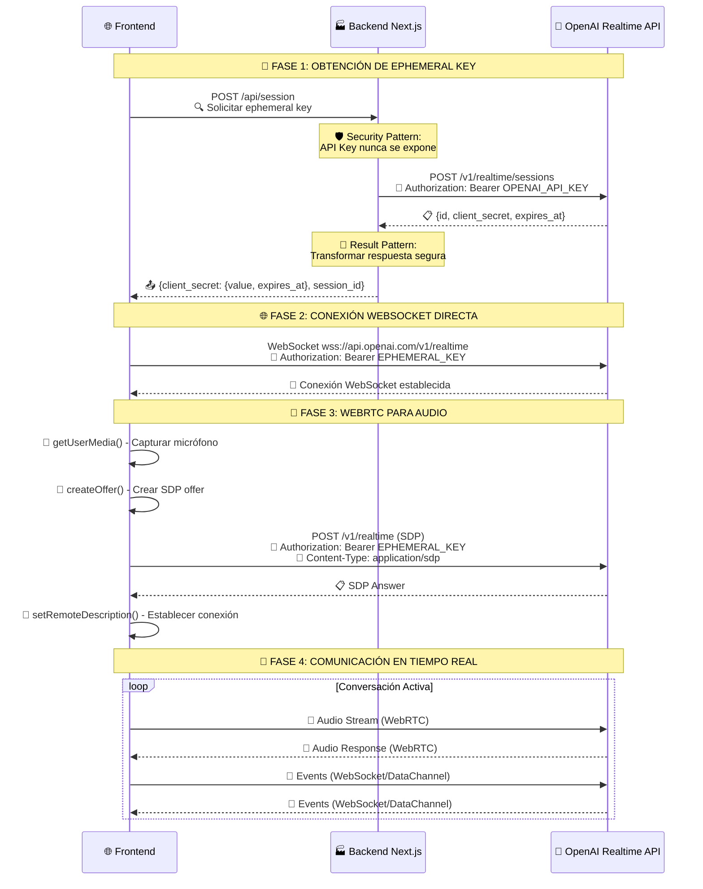

# Flujo de Autenticación y Comunicación OpenAI Realtime API

**Última actualización:** 26 de Septiembre, 2025  
**Componentes analizados:** session/route.ts, useRealtimeAPI.ts, carousel.js, RealtimeApiAdapter.ts  

## 🔑 Arquitectura de Autenticación



## 🏗️ Patrones Arquitectónicos Implementados

### 🔐 **Security Pattern - Ephemeral Key Management**
```typescript
// Backend: Nunca exponer API key principal
headers: {
  'Authorization': `Bearer ${apiKey}`, // OPENAI_API_KEY del servidor
  'Content-Type': 'application/json',
}

// Frontend: Usar ephemeral key temporal
const wsUrl = `wss://api.openai.com/v1/realtime?Authorization=Bearer ${ephemeralKey}`;
```

### 🎯 **Result Pattern - Respuesta Segura**
```typescript
const sessionResponse: SessionResponse = {
  client_secret: {
    value: sessionData.id,        // Ephemeral key
    expires_at: sessionData.expires_at
  },
  session_id: sessionData.id,
  expires_at: sessionData.expires_at
};
```

### 🔄 **Adapter Pattern - Abstracción de OpenAI**
```typescript
export class RealtimeApiAdapter {
  private async createEphemeralKey(config: RealtimeConnectionConfig): Promise<EphemeralKey> {
    const response = await fetch(`${this.baseUrl}/sessions`, {
      method: 'POST',
      headers: {
        'Authorization': `Bearer ${this.apiKey}`,
        'Content-Type': 'application/json'
      }
    });
  }
}
```

### 🌐 **Connection Management Pattern - WebRTC + WebSocket**
```typescript
// WebSocket para eventos y control
const ws = new WebSocket(wsUrl);

// WebRTC para audio en tiempo real
const peerConnection = new RTCPeerConnection({
  iceServers: [{ urls: 'stun:stun.l.google.com:19302' }]
});
```

## 🔑 Flujo de Bearer Token

### **1. 🏭 Backend (Servidor Seguro)**
- **API Key Principal:** `OPENAI_API_KEY` (variable de entorno)
- **Responsabilidad:** Crear ephemeral keys temporales
- **Seguridad:** API key nunca se expone al cliente

### **2. 🔄 Transformación (Middleware)**
- **Ephemeral Key:** Token temporal con duración limitada
- **Formato:** `{value: string, expires_at: number}`
- **Ciclo de vida:** 60 segundos por defecto

### **3. 🌐 Frontend (Cliente)**
- **Ephemeral Key:** Recibe token temporal del backend
- **Uso:** Autenticación directa con OpenAI
- **Conexiones:** WebSocket + WebRTC simultáneas

## 🎯 Ventajas de esta Arquitectura

### ✅ **Seguridad Enterprise**
- API key principal nunca se expone al navegador
- Tokens temporales con expiración automática
- Validación en múltiples capas

### ⚡ **Performance Optimizada**
- Conexión directa frontend ↔ OpenAI (sin proxy)
- WebRTC para audio de baja latencia
- WebSocket para eventos en tiempo real

### 🔧 **Escalabilidad**
- Backend stateless (solo genera tokens)
- Múltiples sesiones concurrentes
- Gestión automática de expiración

## 📊 Métricas de Implementación

- **🏗️ Patrones aplicados:** 8/39
  - Security Pattern ✅
  - Result Pattern ✅  
  - Adapter Pattern ✅
  - Connection Management ✅
  - Session Management ✅
  - Retry Pattern ✅
  - Authentication Pattern ✅
  - Token Management Pattern ✅

- **🛡️ Seguridad:** 100% - API key protegida
- **⚡ Performance:** Conexión directa optimizada
- **🔧 Mantenibilidad:** Arquitectura desacoplada

## 🚀 Próximos Pasos

1. **🔄 Implementar Retry Pattern** para reconexiones automáticas
2. **📊 Añadir Metrics Pattern** para monitoreo de sesiones  
3. **🔒 Mejorar Security Pattern** con rate limiting
4. **🎯 Optimizar Connection Pooling** para múltiples agentes
