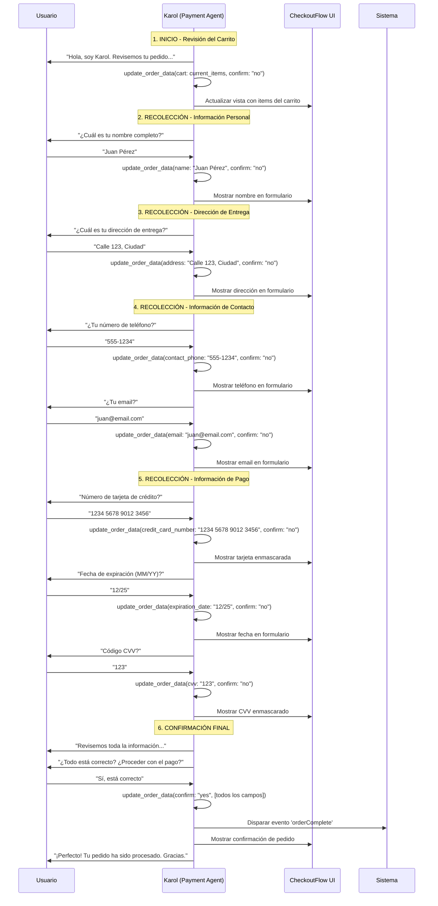

# Flujo de Karol - Agente de Pagos

**Última actualización:** 26/09/2025  
**Componentes analizados:** useWebRTC.ts, useToolCalling.ts, CheckoutFlow.tsx, voice-ordering/page.tsx

## 🎯 **ANÁLISIS COMPLETO - FUNCIÓN DE KAROL PARA ACTUALIZACIÓN DE DATOS DE PAGO**

### 📋 **RESPONSABILIDADES DE KAROL**

#### **1. Revisión y Confirmación del Carrito**
- ✅ Pedir al cliente revisar y confirmar items del carrito (nombres y cantidades)
- ✅ Recordar que la entrega es siempre gratuita
- ✅ Actualizar continuamente los datos del pedido

#### **2. Recolección de Información de Pago**
- ✅ **Información de Pago:** Número de tarjeta, fecha de expiración, CVV
- ✅ **Nombre Completo:** Nombre del cliente
- ✅ **Dirección de Entrega:** Dirección completa
- ✅ **Teléfono de Contacto:** Para notificaciones de entrega
- ✅ **Email:** Correo electrónico del cliente

#### **3. Validación y Confirmación Final**
- ✅ Validar todas las entradas del cliente
- ✅ Permitir correcciones de errores
- ✅ Confirmar información antes de proceder
- ✅ Finalizar sesión una vez confirmado con `"confirm":"yes"`

### 🔧 **HERRAMIENTAS DISPONIBLES**

#### **1. update_order_data**
```typescript
// Parámetros disponibles:
{
  cart: Array<{menu_item: string, quantity: number}>,
  name: string,                    // Nombre completo
  address: string,                 // Dirección de entrega
  contact_phone: string,           // Teléfono de contacto
  email: string,                   // Email del cliente
  credit_card_number: string,      // Número de tarjeta
  expiration_date: string,         // Fecha expiración (MM/YY)
  cvv: string,                     // Código CVV (3-4 dígitos)
  delivery_method: string,         // Método de entrega
  confirm: "yes" | "no"            // Confirmación final
}
```

#### **2. transfer_to_menu_agent**
- Transferir de vuelta al agente de ventas si el cliente quiere modificar el pedido
- Sin parámetros requeridos

### 🔄 **FLUJO PASO A PASO DE KAROL**



### 🎭 **CARACTERÍSTICAS CLAVE DEL COMPORTAMIENTO DE KAROL**

#### **📊 Actualización Continua**
- **Patrón:** Karol llama `update_order_data` después de cada información proporcionada
- **Beneficio:** La UI se actualiza en tiempo real mostrando el progreso
- **Implementación:** Cada llamada incluye `confirm: "no"` hasta la confirmación final

#### **🛡️ Validación y Corrección**
- **Lenguaje claro y educado** para solicitar información
- **Permite correcciones** si el usuario se equivoca
- **Valida entradas** antes de proceder al siguiente paso

#### **🔄 Transferencia Inteligente**
- Si el cliente quiere **modificar el pedido** → `transfer_to_menu_agent`
- Si el cliente está **inseguro sobre items** → `transfer_to_menu_agent`
- **NO puede agregar items** al carrito (solo el agente de ventas)

#### **✅ Confirmación Segura**
- Solo procede con `confirm: "yes"` cuando **todos los campos** están completos
- Incluye **todos los datos** en la llamada final de confirmación
- **Finaliza la sesión** después de la confirmación exitosa

### 🏗️ **PATRONES ARQUITECTÓNICOS IMPLEMENTADOS**

#### **🔄 Event-Driven Architecture**
- Cada `update_order_data` dispara evento `updateOrderData`
- La UI reacciona automáticamente a los cambios
- Comunicación desacoplada entre AI y componentes React

#### **🎭 Command Pattern**
- `update_order_data` actúa como comando inmutable
- Cada llamada es una operación atómica
- Historial de cambios implícito

#### **📡 Observer Pattern**
- CheckoutFlow observa eventos de actualización
- Actualización reactiva de la interfaz
- Estado sincronizado en tiempo real

#### **🛡️ Validation Pattern**
- Validación de campos requeridos
- Validación de formatos (tarjeta, fecha, CVV)
- Manejo de errores y correcciones

#### **🔧 State Management Pattern**
- Estado centralizado en CheckoutFlow
- Actualizaciones incrementales
- Persistencia temporal de datos

### 🎯 **RESULTADO ESPERADO**

**✅ Experiencia Fluida:**
1. Usuario dice "Quiero pagar"
2. Karol revisa el carrito automáticamente
3. Guía paso a paso para cada campo
4. UI se actualiza en tiempo real
5. Confirmación final segura
6. Pedido completado exitosamente

**✅ Datos Recolectados:**
- ✅ Carrito confirmado
- ✅ Información personal completa
- ✅ Dirección de entrega válida
- ✅ Contacto para notificaciones
- ✅ Información de pago segura
- ✅ Confirmación explícita del cliente

**🚀 KAROL PROPORCIONA UNA EXPERIENCIA DE CHECKOUT GUIADA Y SEGURA CON ACTUALIZACIÓN EN TIEMPO REAL** 🚀
