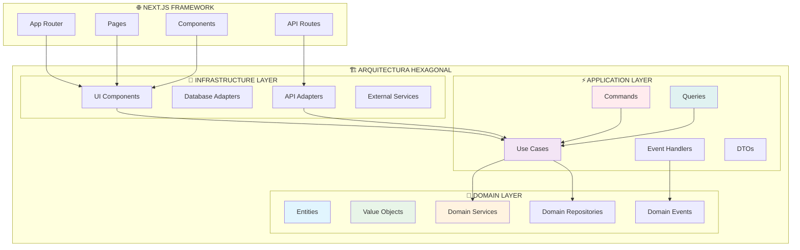

# Arquitectura del Proyecto Realtime-OpenAI-AX

**Última actualización:** 26 de Septiembre, 2025  
**Componentes analizados:** Estructura inicial Next.js  

## 🎯 Patrones Arquitectónicos Objetivo

### 🔷 Capa Domain (DDD)
- **Entities:** Objetos con identidad única
- **Value Objects:** Objetos inmutables sin identidad
- **Domain Services:** Lógica de negocio compleja
- **Domain Events:** Comunicación entre bounded contexts

### ⚡ Capa Application (CQRS)
- **Commands:** Operaciones que modifican estado
- **Queries:** Operaciones de solo lectura
- **Use Cases:** Orquestación de lógica de aplicación
- **Event Handlers:** Procesamiento de eventos de dominio

### 🔧 Capa Infrastructure
- **Adapters:** Implementaciones concretas de puertos
- **External Services:** Integraciones con APIs externas
- **UI Components:** Componentes de interfaz de usuario
- **Database:** Persistencia y acceso a datos

## 📊 Estado Actual
- **Estructura creada:** ✅ Carpetas base configuradas
- **Patrones implementados:** 0/39
- **Próximo paso:** Implementar entidades de dominio básicas
